# Luxvane

Luxvane is a Node.js application that provides a web interface for managing e-commerce inventory. It supports product CRUD operations, category management, analytics, and automated product description generation using Google Gemini API.

## Features

**Product Management**
- Full CRUD operations for products
- Image uploads handled by Cloudinary
- Products can be assigned to categories and filtered by category
- Product attributes including pricing, descriptions, and discounts
- Search products by name or description
- Sort products by name, price, or date (ascending/descending)
- Category-based filtering with sidebar navigation

**AI Description Generator**
- Generates product descriptions using Google Gemini
- Analyzes product images and metadata
- Outputs descriptions under 350 characters
- Real-time timer feedback during generation

**Category Management**
- Create and manage product categories
- Filter products by category

**Analytics**
- Product and category statistics
- Price range distribution with Chart.js visualizations
- Recent product tracking (last 7 days)
- Discount analytics
- Interactive charts for category distribution and price ranges

**Authentication**
- JWT-based authentication
- Password hashing with bcrypt
- Protected routes via middleware
- Session management with express-session
- Flash messages for user feedback

**Dashboard**
- Quick navigation to main features

**API Documentation**
- Swagger/OpenAPI documentation available at `/api-docs`
- Interactive API testing interface
- Currently documented: Category endpoints
- Plan to extend documentation to all endpoints (Products, Analytics, Authentication)

**Health Monitoring**
- `/health` endpoint for basic health checks
- `/ready` endpoint for readiness checks with database status

**Security**
- Helmet.js for HTTP header security
- Rate limiting (100 requests per 15 minutes)
- Input validation with express-validator
- Content Security Policy (CSP) configured

**Testing**
- Jest test framework
- Supertest for API testing
- Test coverage for health endpoints, authentication, and categories

**Logging**
- Winston logger with file and console output
- Separate error and combined log files
- Environment-based log levels

## Requirements

- **Node.js** 14 or higher
- **npm** 6 or higher (comes with Node.js)
- **MongoDB** (local installation or MongoDB Atlas account)
- **Google Gemini API key** (get from [Google AI Studio](https://makersuite.google.com/app/apikey))
- **Cloudinary account** (for image uploads - [sign up here](https://cloudinary.com))
- **nodemon** (optional, for development auto-reload - can be installed globally: `npm install -g nodemon`)

## Installation

1. Clone the repository
   ```bash
   git clone https://github.com/bhavneet334/Luxvane.git
   cd Luxvane
   ```

2. Install dependencies
   ```bash
   npm install
   ```
   This will install all required packages including dev dependencies (Jest, Supertest, Prettier).

3. Set up environment variables
   
   The application uses **two configuration methods**:
   
   **A. `.env` file (for most variables)**
   
   Create a `.env` file in the root directory with these variables (see Environment Variables section below):
   - API keys (Google Gemini, Cloudinary)
   - Secrets (JWT, session)
   - Port and NODE_ENV
   - **Note:** MongoDB URI can also go here, but see option B below
   
   **B. `config/development.json` (for MongoDB URI - current setup)**
   
   The MongoDB connection currently uses the `config` package which reads from JSON files. Create `config/development.json`:
   ```json
   {
     "MONGODB_URI": "your_mongodb_connection_string"
   }
   ```
   
   **How it works:**
   - The `config` package reads `MONGODB_URI` from `config/development.json`
   - All other variables are read from `.env` file via `dotenv` → `process.env`
   - This is the current setup in the code
   
   **Simplest approach:** Create both files:
   - `.env` file with all variables (see Environment Variables section)
   - `config/development.json` with just the MongoDB URI (as shown above)

4. Start the application
   ```bash
   npm start
   ```
   For development with auto-reload (requires nodemon):
   ```bash
   npm run dev
   ```
   Note: If `nodemon` is not installed, you can install it globally with `npm install -g nodemon` or it will be installed as a dev dependency when you run `npm install`.

5. Access the application at http://localhost:4400

6. Run tests (optional)
   ```bash
   npm test
   ```

## Environment Variables

Create a `.env` file in the root directory with all required variables:

```
MONGODB_URI=your_mongodb_connection_string
GOOGLE_API_KEY=your_google_gemini_api_key
CLOUD_NAME=your_cloudinary_cloud_name
API_KEY=your_cloudinary_api_key
API_SECRET=your_cloudinary_api_secret
JWT_KEY=your_jwt_secret_key
MY_SECRET_KEY=your_session_secret_key
```

**Note:** The MongoDB URI is currently read from `config/development.json` by the `config` package. Make sure to create that file as well (see Installation step 3).

Optional variables:

```
PORT=4400
NODE_ENV=development
```

PORT defaults to 4400. NODE_ENV defaults to development, which enables console logging and development only endpoints.

## First Admin User

In development mode, create the first admin user by sending a POST request to `/owners/create`:

```
POST /owners/create
{
  "fullname": "Admin Name",
  "email": "admin@example.com",
  "password": "password"
}
```

This endpoint only works when NODE_ENV is set to development and no owners exist in the database.


## Project Structure

```
Luxvane/
├── config/              # Configuration files
├── middlewares/         # Custom middleware
├── models/              # Mongoose models
├── routes/              # Express routes
├── utils/               # Utility functions
├── views/               # EJS templates
├── public/              # Static assets (CSS, JS, images)
│   ├── javascripts/     # Client-side JavaScript
│   ├── stylesheets/     # CSS files
│   └── images/          # Image assets
├── tests/               # Test files
├── logs/                # Log files
└── app.js               # Main application file
```

## Logging

Logs are written to the `logs/` directory:
- `error.log` - Error level logs only
- `combined.log` - All log levels

In development mode (NODE_ENV=development), logs are also written to the console. In production, logs are written to files only.

## Screenshots

### Authentication
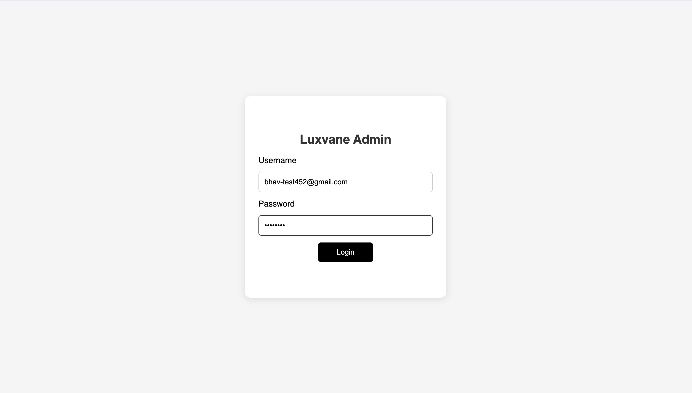
*Admin login interface*

### Dashboard
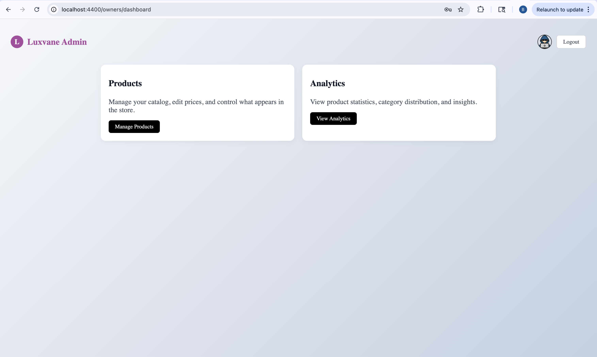
*Main admin dashboard with quick navigation to products and analytics*

### Product Management
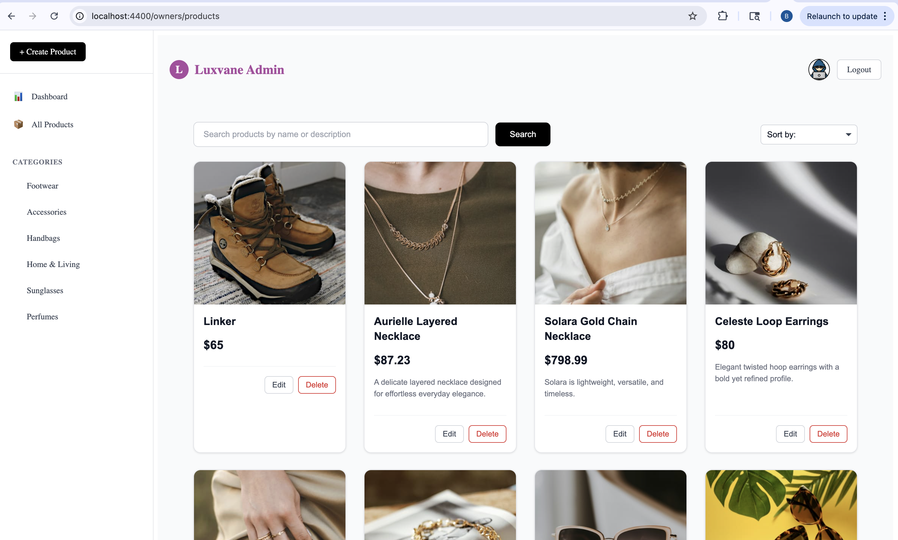
*Product listing with sidebar navigation and category filters*

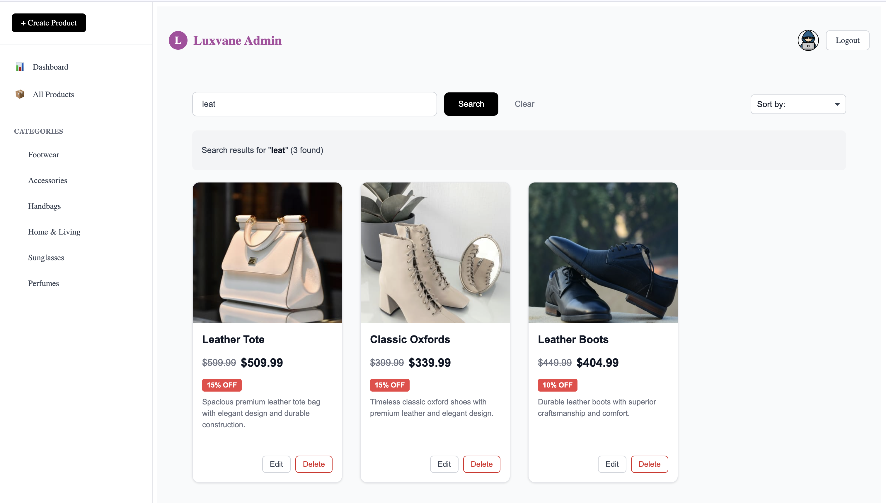
*Search products by name or description*

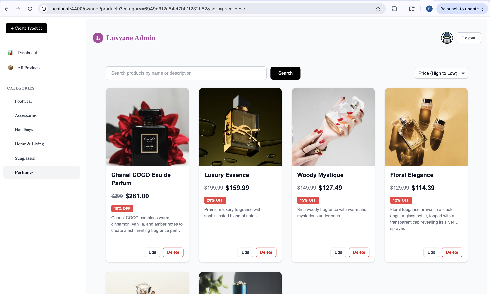
*Sort products by name, price, or date*

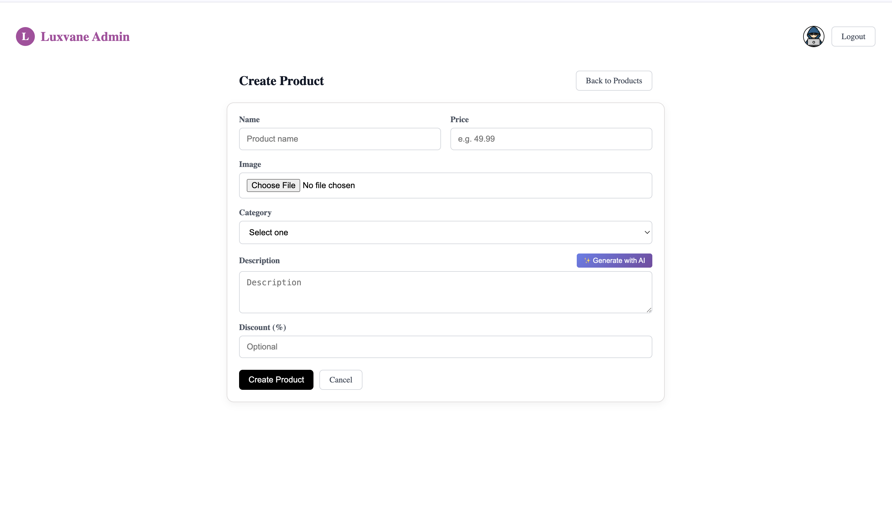
*Product creation form with all fields*

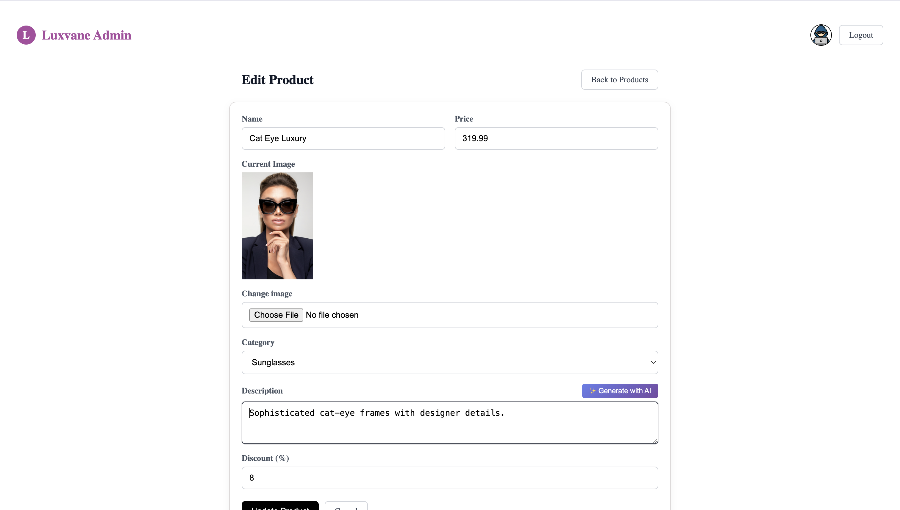
*Product editing interface*

### AI Description Generator
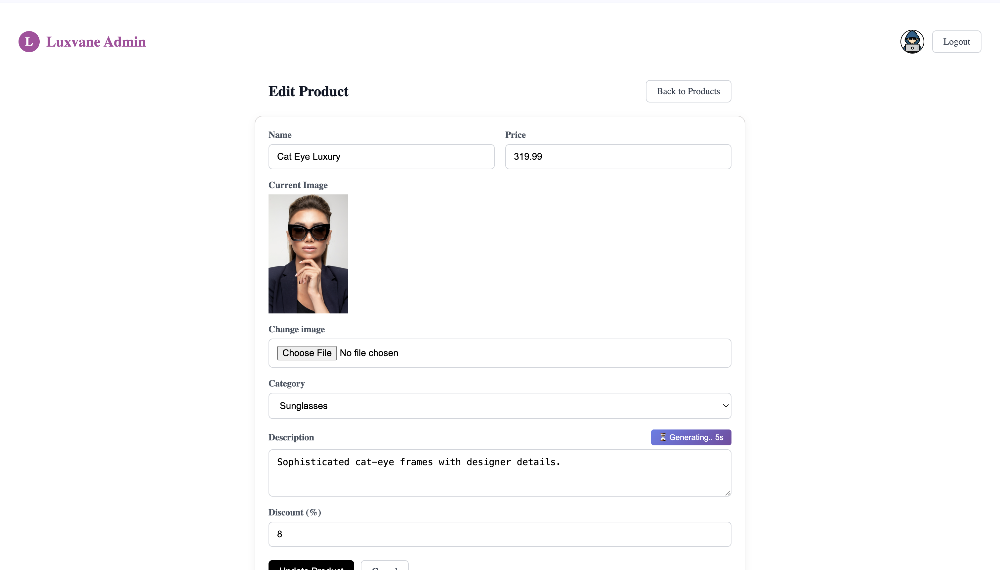
*AI description generator with real-time timer feedback*

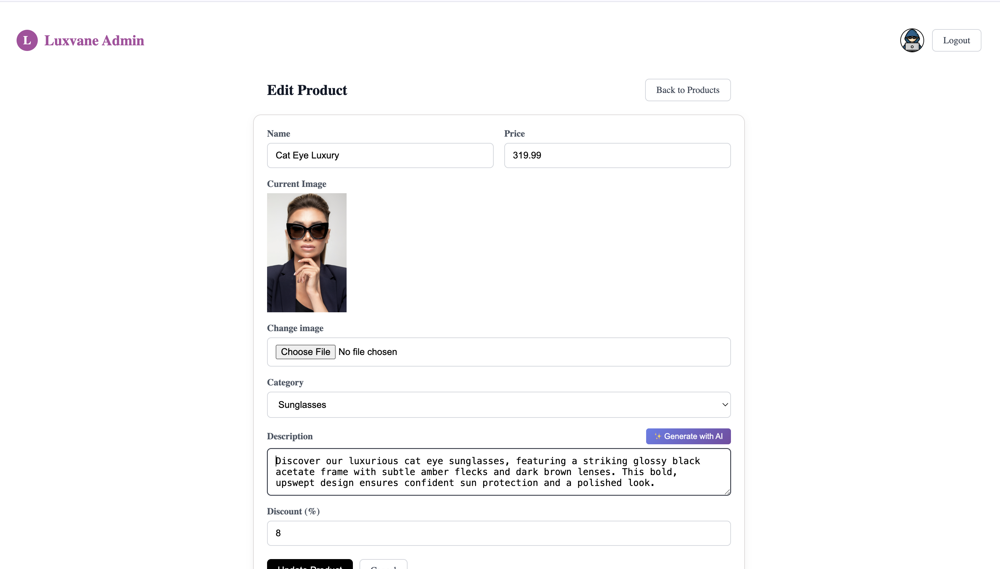
*Generated product description displayed in the form*

### Analytics

*Analytics dashboard with statistics and charts*

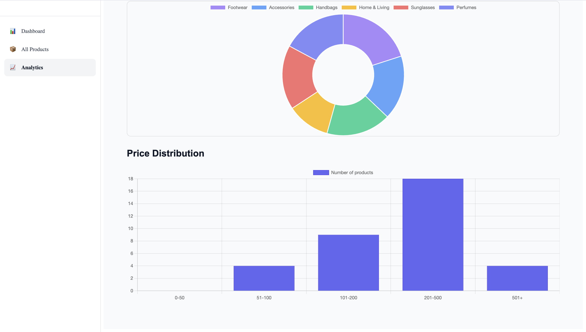
*Detailed analytics with category distribution and price ranges*

### API Documentation
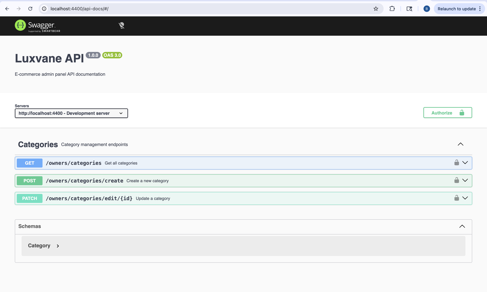
*Swagger/OpenAPI interactive documentation at `/api-docs` (currently documents Category endpoints)*

## Author
- Built by Bhavneet Kaur
- Feel free to fork, clone, or contribute.
